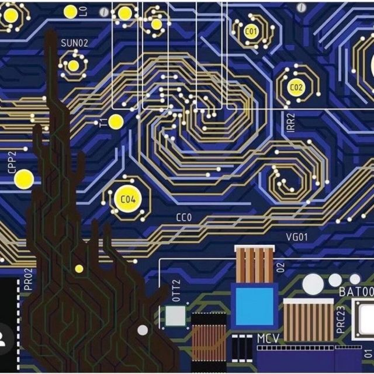

# 123
## an H2 sized header.
#### an H4 sized header.

[](https://www.chaoxing.com/)

[chaoxing](https://www.chaoxing.com/)

[jump to README2.md](README2.md)




```c++
#include <iostream>
using nanespace std;
int main()
{
    cout << "Hello World!" << endl;
    return 0;
}
```

> a block quote.

a bulleted list.
* first
* second
* third

a numbered list.
1. 一
    - 第一个元素
    - 第二个元素
2. 二
    - 第一个元素
    - 第二个元素

| 表格 | 第一列 | 第二列 | 第三列|
| :-----| :----:| :----: | :----: |
| 第一行 | q | q | q |
| 第二行 | q | q | q |
| 第三行 | q | q | q |

**bolded text**

*italicized text*

~~strikethrough text~~

***
